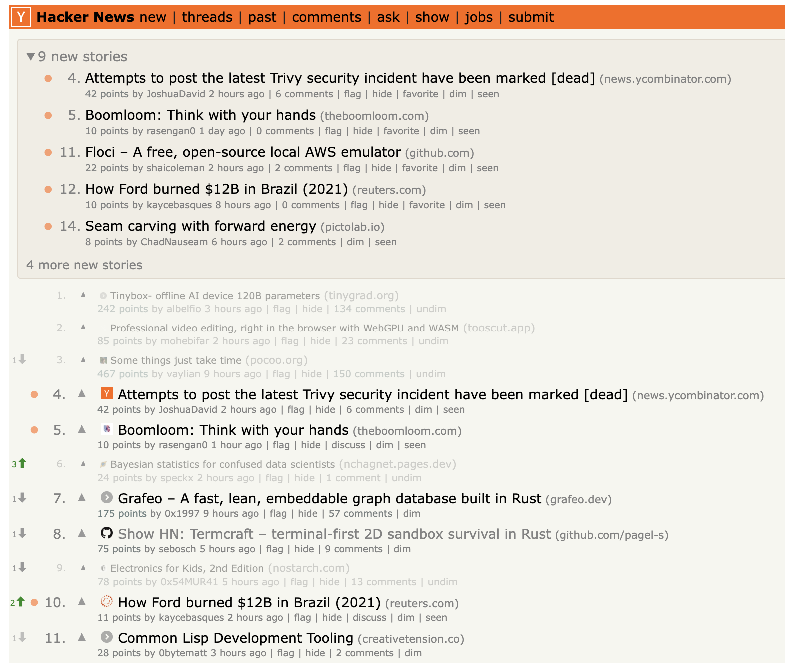

# Hacker News Mod chrome extension

A Chrome extension that enhances Hacker News with favicons, new/trending
indicators, keyword/domain dimming, score colorization, and an unseen stories
panel.



## Features

- **Story dimming** — dim stories by keyword or domain, with manual dim/undim
  toggle per story
- **New story indicators** — red dots fade over 30 minutes for newly seen
  stories
- **Trend arrows** — show rank changes vs previous page load
- **Unseen stories panel** — collapsible section showing stories you haven't
  seen yet
- **Score/comment colorization** — color intensity scales with points and
  comment count
- **Favicons** — site icons next to story titles for quick visual scanning

## Install

[**Chrome Web Store**](https://chromewebstore.google.com/detail/fgbmgcggdemccdhdapkhnkkcooeljabm)

### Manual installation

1. Clone the repo
2. Run `npm install` and `npm run build`
3. Enable developer mode under Manage Extensions
4. Load Unpacked → select the `dist/` folder
5. Go to the extension options page and set your keywords/domains for dimming

## Development

```sh
npm install          # install dependencies
npm run build        # one-off dev build → dist/
npm run watch        # rebuild on file changes
```

### Type checking

The build uses esbuild which skips type checking for speed. Run the type checker
separately:

```sh
npm run typecheck    # tsc --noEmit
```

### Tests

```sh
npm test             # run once
npm run test:watch   # watch mode
```

### Linting & formatting

```sh
npm run lint         # check for issues
npm run lint:fix     # auto-fix
npm run format       # format all source files
npm run format:check # verify formatting
```

### Packaging

```sh
npm run package      # minified build + zip for publishing
```
